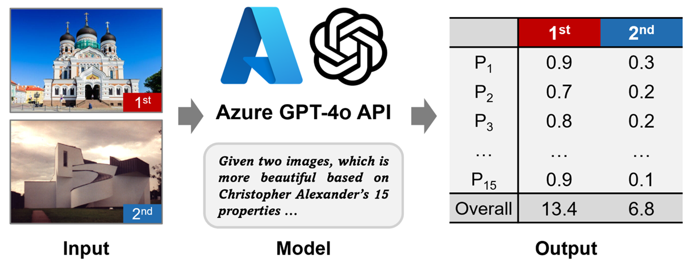

# Beauty Score Evaluator

A computational tool for evaluating architectural beauty based on Christopher Alexander's 15 properties of living structure. This project is part of my Master's thesis _Characterizing Architectural and Urban Beauty from the Perspective of Living Structure Using AI and Geospatial Big Data_, which leverages recent advancements in Large Language Models (LLMs) to compute the degree of beauty for building façades and street views, providing an objective measure of architectural aesthetics.



### Datasets

- **ScenicOrNot Dataset**: 184,903 images in toal, including 15,806 images featuring building façades from [ScenicOrNot](https://scenicornot.datascienceforgood.com/)
- **Architectural Styles Dataset**: 5,000 architectural images with 25 classess, 6 groups
- **Urban Scene Categories**: 19 categories from [Places365](http://places2.csail.mit.edu/) dataset

## Features

- **Architectural Image Selection**: Uses CLIP (Contrastive Language-Image Pre-training) for zero-shot classification of architectural images
- **Beauty Score Evaluation**: Implements GPT-4 Vision API for evaluating images based on Alexander's 15 properties
- **Batch Processing**: Efficiently processes large image datasets
- **GPU Acceleration**: Supports GPU acceleration for faster processing
- **Standardized Output**: Machine-readable format for large-scale analysis

## Properties Evaluated

The beauty score evaluation is based on Christopher Alexander's 15 properties of living structure:

<table style="font-weight: normal;">
    <tr>
        <td>Levels of Scale</td>
        <td>Strong Centers</td>
        <td>Thick Boundaries</td>
        <td>Alternating Repetition</td>
        <td>Positive Space</td>
    </tr>
    <tr>
        <td>Good Shape</td>
        <td>Local Symmetries</td>
        <td>Deep Interlock and Ambiguity</td>
        <td>Contrast</td>
        <td>Gradients</td>
    </tr>
    <tr>
        <td>Roughness</td>
        <td>Echoes</td>
        <td>The Void</td>
        <td>Simplicity and Inner Calm</td>
        <td>Not-Separateness</td>
    </tr>
</table>

## Requirements

- Python 3.x
- torch
- transformers
- Pillow
- tqdm
- requests
- CLIP model: [openai/clip-vit-base-patch32](https://huggingface.co/openai/clip-vit-base-patch32)
- GPT-4 Vision API access ([HKUST-GZ ITD service](https://itd.hkust-gz.edu.cn/en/ITServices-GPT))

## Installation

1. Clone this repository:

```bash
git clone https://github.com/Andy-Jingqian-Xue/beautimeter
cd beauty-score
```

2. Install the required packages:

```bash
pip install torch transformers Pillow tqdm requests
```

3. Configure the API key:
   - Open `beauty.py`
   - Replace `YOUR_API_KEY_HERE` with your GPT-4 Vision API key from HKUST-GZ ITD

## Usage

### Image Selection

1. Place your input images in the `images` directory
2. Run the selection script:

```bash
python selection.py
```

The script uses CLIP's zero-shot capabilities to classify images based on the prompt "a photo with buildings". Images with confidence scores above 0.8 are selected as architectural images and copied to the `architectural_images` directory.

### Beauty Score Evaluation

1. Ensure you have two images to compare in the `images` directory
2. Run the beauty score evaluation:

```bash
python beauty.py
```

The script uses GPT-4 Vision API to evaluate image pairs based on Alexander's 15 properties. Each property is scored from 0 to 1, with the output formatted for machine readability.

## Configuration

### Image Selection (`selection.py`)

- `INPUT_FOLDER`: Directory containing input images (default: "images")
- `OUTPUT_FOLDER`: Directory for selected images (default: "architectural_images")
- `CONFIDENCE_THRESHOLD`: Threshold for architectural content confidence (default: 0.8)
- `BATCH_SIZE`: Number of images to process at once (default: 4)
- `CLIP_MODEL`: "openai/clip-vit-base-patch32"

### Beauty Scoring (`beauty.py`)

- `API_URL`: GPT-4 Vision API endpoint (HKUST-GZ ITD service)
- `API_HEADERS`: API configuration including your API key

## Output Format

The beauty score evaluation outputs scores in a machine-readable format:

`Levels of Scale: 0.xx, Strong Centers: 0.xx, ..., Not-Separateness: 0.xx`

Each property is scored from 0 to 1, with 1 being the highest score.

## Dataset

The datasets used in this research are available at: [Figshare Repository](https://doi.org/10.6084/m9.figshare.29261888.v1)

## Acknowledgments

- OpenAI for the [CLIP](https://huggingface.co/openai/clip-vit-base-patch32) and GPT-4 Vision models
- HKUST-GZ ITD for providing [GPT-4 Vision API service](https://itd.hkust-gz.edu.cn/en/ITServices-GPT)
- [ScenicOrNot](https://scenicornot.datascienceforgood.com/), [architectural style dataset](https://link.springer.com/chapter/10.1007/978-3-319-10590-1_39) from Xu et al., and [Places365](http://places2.csail.mit.edu/) datasets
